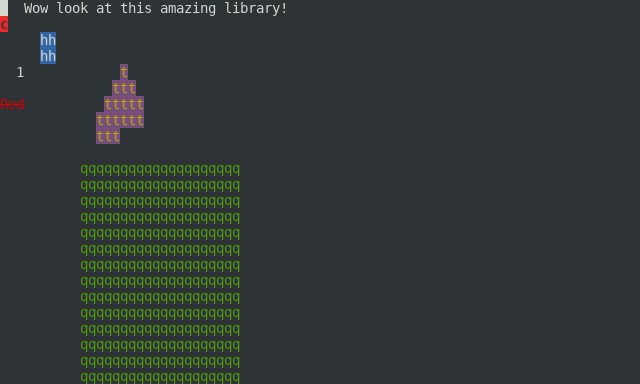

# clojure-lanterna

A wrapper around the Lanterna text user interface library.



## Leiningen

    [clojure-lanterna "....."]

## License

This project is a fork of clojure-lanterna, by Steve Losh, although it does not
have a compatible API. It does, however, wrap a significantly larger portion of
the API and provide more generality.

Distributed under the LGPLv2, the same as Lanterna itself.

## Versions

CLOJURE-LANTERNA is a wrapper around Lanterna 3.0.0-beta3. If you wish to use
Lanterna 2, see clojure-lanterna.

## Example

``` clojure
(ns project.ns
  (:gen-class)
  (:require [lanterna.screen :as s])
  (:require [lanterna.terminal :as t])
  (:require [lanterna.input :as i])
  (:require [lanterna.graphics :as g]))

(def terminal-size (ref [0 0]))
(defn handle-resize [term cols rows]
  (dosync (ref-set terminal-size [cols rows])))

(defn -main
  [& args]
  (let [term (s/get-screen {:palette :gnome :title "Hello" :resize-listener handle-resize})]
    (doto term
      (s/start!)
      (s/redraw!)
      (t/put-char! \c 0 1 {:fg :red :styles [:reverse :bold]})
      (t/put-string! "Wow look at this amazing library!" 3 0)
      (t/put-string! "Red" 0 6 {:fg :red :styles [:strikethrough]})
      (g/fill-rectangle! 10 10 30 20 \q {:fg :green})
      (g/fill-rectangle! 5 2 2 2 \h {:fg :white :bg :blue :styles [:bold]})
      (g/fill-triangle! 15 4 12 8 17 6 \t {:fg :yellow :bg :magenta :styles [:bold]})
      (t/move-cursor! 2 4)
      (t/put-char! \1)
      (s/redraw!)
      (i/get-keystroke-blocking)
      (s/stop!))))
```
